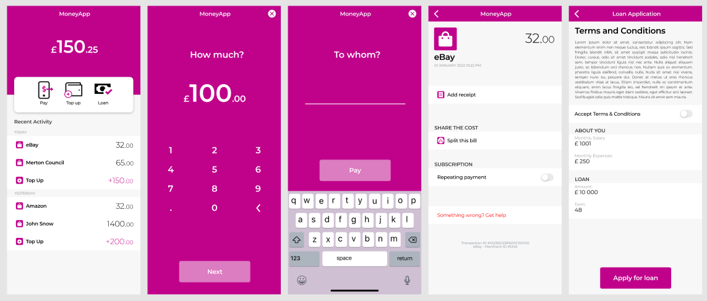

# 💸 MoneyApp

A sleek and modern mobile app built with Flutter for sending payments, topping up, and applying for loans. The app is designed featuring a clean interface and intuitive flow for handling personal finances.

---



---

## 🚀 Features

- 💰 **Pay**, **Top up**, and **Loan** options
- 📋 Transaction history with amount tracking
- 📱 Easy input for amount and recipient
- 🧾 Add receipt and split payments
- 🔁 Repeating payment toggle
- 📄 Loan application form with terms & conditions

---

## 🛠 Technologies Used

- **Flutter** – UI toolkit for building natively compiled applications
- **Dart** – Programming language optimized for building UI
- **Material Design** – Clean and intuitive interface
- **State Management** – (e.g., Provider, setState – depending on your implementation)
- **Responsive UI** – Works on various screen sizes

---

## 📦 Getting Started

To run this project locally:

```bash
git clone https://github.com/yourusername/moneyapp.git
cd moneyapp
flutter pub get
flutter run
